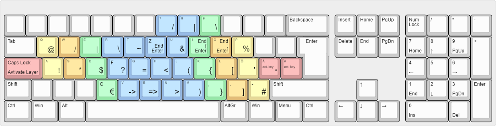
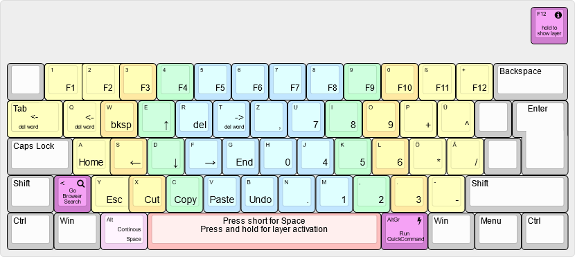

# Better Coding Layout
----------------------

### Disclaimer

This Keyboard Layout is an extension of [kwrtz] german programer [keybord layout][kwrtz-layout].
Make sure to check his repo out, if you like this one.

----------------------------

[kwrtz] Keyboard Layout is based on Standard German QWERTZ with the addition of two layers.
I added some features, like a web search, a [quick-command window](#quickcommand-window) and a  [window-switch](#windowswitch) together with a third "layer" to ease coding on a german keyboard layout.

Although this layout is based on a QWERTZ keyboard it can easily be adopted to any other keyboard.

## Installation

To use the script you have to install [AutoHotkey][ahk]. This can either be done via their installer, the Windows Store or using [Scoop][scoop].


<details open>
<summary>Installation via Scoop</summary>
<br>

If you don't have scoop installed. First install it. Open [Powershell][powershell] and type:
```PowerShell
Set-ExecutionPolicy RemoteSigned -Scope CurrentUser # Optional: Needed to run a remote script the first time
irm get.scoop.sh | iex
```

Then restart your Terminal and run:
```PowerShell
scoop bucket add extras # adds the extra bucket
scoop install autohotkey # installs autohotkey
```

</details>

Once installed just clone the repository and open `better_coding.ahk` with AutoHotKey. Alternatively, you can also just copy the content of the files (`better_coding.ahk` and all files in utils) in one file and run this file with AutoHotKey.


<details open>
<summary>Want to auto run the script on startup?</summary>
<br>

If you want the script to auto run when start up. You may compile the .exe file by going into the folder you clone the repository into and run

```PowerShell
ahk2exe /in .\better_coding.ahk /out .\better_coding.exe
```

or (if you want to use the icon)

```PowerShell
ahk2exe /in .\better_coding.ahk /out .\better_coding.exe /icon .\icons\better-coding-icon.ico
```

Create a shortcut to the .exe file and place it in the startup folder. You can find the startup folder by pressing <kbd>![Windows Key][newwinlogo]</kbd> + <kbd>r</kbd> and type
```
shell:startup
```
</details>


## The Layers

If you want to see the layout when using the script simply hold the respective layer key and press <kbd>F12</kbd>. As long as you keep <kbd>F12</kbd> pressed, the layout will be displayed.

### Special Keys Layer

The following Layer is enabled by holding <kbd>CapsLock</kbd>, <kbd>ä</kbd> or <kbd>#</kbd> down. The normal functionality of CapsLock is deactivated! Releasing the ä or # key, will print the respective character.



### Layer for numbers and cursor movements

The following layer can be activated by holding <kbd>Space</kbd> down. If you press the <kbd>Space</kbd> key short, a Space character is printed (when the <kbd>Space</kbd> key is released). If you want a continuous printing of Space you have to hold down <kbd>Space</kbd> and press <kbd>Alt</kbd>.
The layer was designed like the Ebene 4 of the neo-layout.org - but not exactly.

Pressing <kbd><</kbd> will run a web search with the currently selected text. The search-engine may be "google", "brave", "ecosia" or "duckduckgo" and can be set at the beginning of ``better_coding.ahk``. Pressing <kbd>AltGr</kbd> will open the [`QuickCommand-Window`](#quickcommand-window)



### Additional functionalities layer

The following layers [window-switch](#windowswitch) functionalities can be activated by holding <kbd>AltGr</kbd> down. The arrow key functionalities on the right side of the keyboard are available by pressing *<kbd>Alt</kbd>*.


## Added Functionalities

### QuickCommand-Window

The quick-command window is a small input box gui on the lower left corner of the display, which can be used to type in web search inquiries, open web pages. It also allows to define and use snippets to open web pages without typing the whole domain. Snippets are stored in
`quick-command-snippets.txt`. One may edit this file either by opening it in any editor, or by running on of the following commands via the quick-command window: `:Edit:`, `:edit:`, `:e:`, `:edit`, `:Edit`, `:e` or `e:`. Most of the times you only want to add a snippet. This can be done by entering any of `:Add:`, ``:add:``, ``:a:``, ``:add``, ``:Add``, `:a` or `a:`. The use is then prompted for the snippet and its expansion.

Note, the `quick-command-snippets.txt` currently needs to be in the same folder as the script. If file is found, the user is asked, if a file shall be created.

### WindowSwitch

``WindowSwitch`` allows to quickly switch between windows. It does:
- open the chosen window, if it does not exist.
- minimizes the chosen window, if it is active.
- makes the chosen window active, if it exists and is not active.

Currently, implemented are window-switches for the following windows/programs:

- Editor (Default [VSCode])
- Terminal
- File Explorer
- Messenger (Default Teams)
- Reference Manager (Default [Zotero])
- Password Manager (Default [KeePass])
- Browser (Default Firefox)

!!! IMPORTANT !!!

**Note, that the paths for the several currently need to be defined in the script. You need to check, if the given ones are correct. Otherwise, adopt them to your needs.**


!!! IMPORTANT !!!

# Todo

- Add config.json, such that configurations, like the chosen browser, path files, etc. do not need to be defined in the script.
- Add Gui to set configuration
- Create Installer


# Resources

- [kwrtz][kwrtz]
- [autohotkey-german-programmer-layer][kwrtz-layout]
- [AutoHotkey][ahk]
- [Scoop][scoop]
- [Powershell][powershell]
- [Zotero][Zotero]
- [KeePass]
- [VSCode]
- [AutoHotkey-JSON]

[kwrtz]:            https://github.com/kwrtz
[kwrtz-layout]:     https://github.com/kwrtz/autohotkey-german-programmer-layer
[ahk]:              https://www.autohotkey.com/
[scoop]:            https://scoop.sh/
[powershell]:       https://github.com/PowerShell/PowerShell
[Zotero]:           https://www.zotero.org/
[KeePass]:          https://keepass.info/
[VSCode]:           https://code.visualstudio.com/
[AutoHotkey-JSON]:  https://github.com/cocobelgica/AutoHotkey-JSON
[winlogo]:          https://i.stack.imgur.com/Rfuw7.png
[newwinlogo]:       https://i.stack.imgur.com/B8Zit.png
[oldwinlogo]:       https://i.stack.imgur.com/T0oPO.png